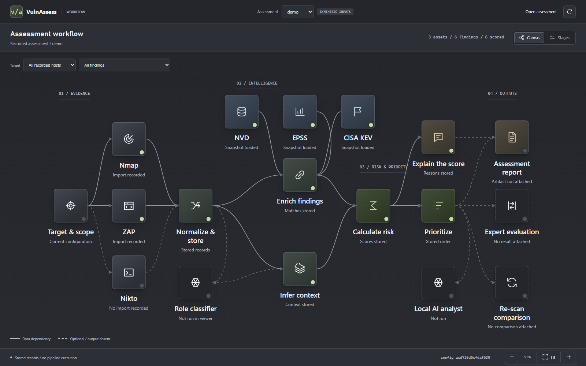
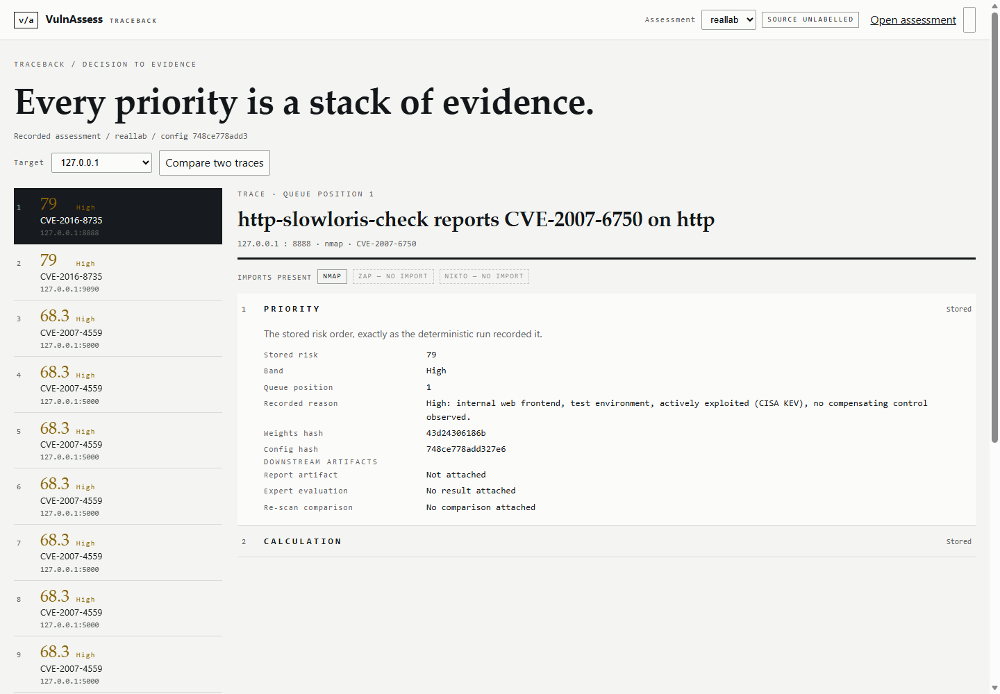
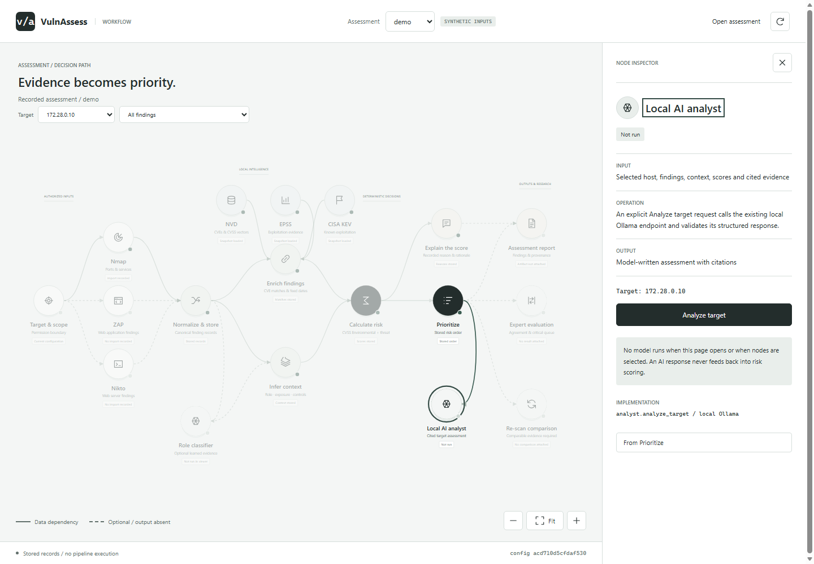
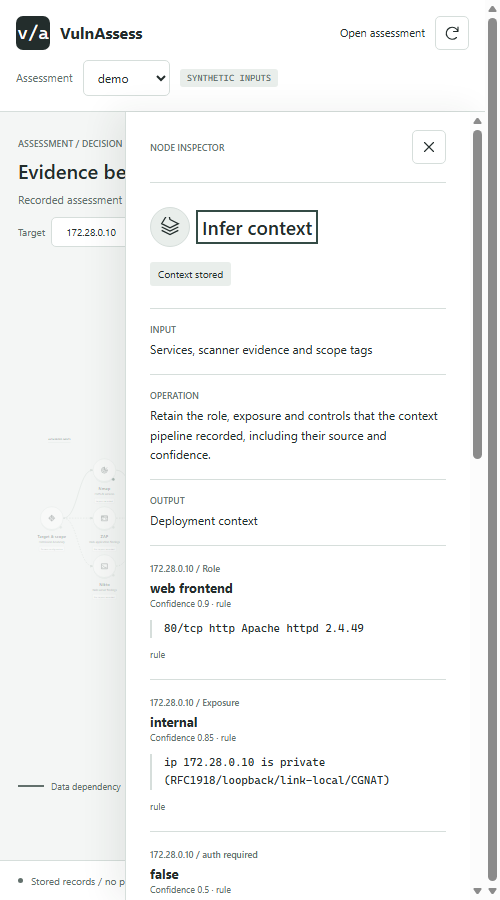

# vulnassess — rank vulnerabilities by risk *to this network*, not by CVSS alone

You already have scanner output. Two hosts can carry the same CVE with the same 9.8 base
score, and they are **not** equally urgent: one is an internet-facing web frontend, the
other an isolated test box behind a WAF. CVSS stops at the base score; this tool keeps
going. It reads the Nmap/Nikto/ZAP output you already have, enriches every finding from
**real offline snapshots of NVD, EPSS and the CISA KEV catalog**, infers each host's
deployment context from the scan evidence itself, and produces a ranked queue with a
one-line reason, a fix target, and a self-contained HTML report.

```text
Same CVE, same CVSS base - different risk:  CVE-1999-9001

                                 172.28.0.12       172.28.0.10
CVSS base                                9.8               9.8
Role                                database      web_frontend
Exposure                     internet_facing          internal
WAF                                       no                no
EPSS percentile                          100               100
KEV                                      yes               yes
CVSS environmental                       9.8               6.9
RISK                                   100.0              79.0
BAND                                Critical              High
```

(A synthetic acceptance case: it demonstrates the mechanism, and is labelled as such
everywhere it appears.)

## Quickstart

Python 3.11+, two runtime dependencies (`pyyaml`, `packaging`), everything else stdlib.

```bash
pip install -r requirements.txt

# 1. Fetch the real public feeds once (KEV ~3 MB, EPSS ~3 MB, NVD mirror ~1 GB):
python scripts/fetch_feeds.py          # rate-limited, resumable, provenance-logged

# 2. Watch the whole pipeline over the labelled synthetic demo inputs:
python run_demo.py                        # writes reports/demo.html

# 3. Or run the same pipeline with the REAL feeds against a hand-built lab capture
#    (examples/real_lab_nmap.xml — invented hosts, real CVEs, real enrichment):
python run_real_demo.py                   # writes reports/real-feeds-lab.html

# 4. Run it on your own authorised scan output:
vulnassess intel load --from-dir data/feeds
vulnassess import --run-id lab1 --target-ip 172.28.0.10 --nmap out.xml
vulnassess enrich  --run-id lab1
vulnassess context --run-id lab1
vulnassess rank    --run-id lab1
vulnassess report  --run-id lab1 --out reports/lab1.html
```

The feeds are fetched straight from their official publishers (CISA, FIRST/CIyentia,
NIST) and never through this repo; `docs/FEED_PROVENANCE.md` records every URL, date,
SHA-256 and row count. The runtime itself still reaches no network, ever.

## What it does with your scan

1. **Match** each finding to a CVE — the ID the scanner named explicitly, or CPE
   version-range matching against NVD's configuration data, with a recorded
   accept/reject trace for every decision.
2. **Enrich** from the offline snapshots: CVSS v3.1/v4.0 vectors, EPSS score and
   percentile, KEV presence, patch references, description.
3. **Infer context from the scan itself**: host role, internet-facing vs internal,
   WAF observed, authentication observed — each inference carries a confidence, a
   source, and the verbatim scan quote that triggered it (or `none observed`).
4. **Auto-fill the CVSS Environmental metrics** a human would otherwise skip: an
   internal host softens `AV:N` to `MAV:A`, an observed WAF raises `MAC`, observed
   auth raises `MPR`, the inferred role sets the C/I/A requirements.
5. **Score**: `risk = environmental × 10 × threat`, `threat = 0.5 + 0.5 × EPSS
   percentile`. A missing EPSS row is **unscored, not defaulted**. A KEV listing
   forces `threat` to 1.0 and adds 10 — but the Critical floor of 90 applies **only
   when the host is internet-facing**. An actively exploited flaw on an isolated test
   box lands in High, not Critical. The formula lives in `config/weights.yaml` and its
   hash is printed in every report footer.

## Where the LLM fits (and where it cannot go)

`vulnassess explain` may hand a finding to local Ollama to reword its one-line rationale.
The live workbench also has an explicit **Analyze target** action. It sends the selected
host's stored services, findings, context, CVSS, EPSS, KEV and deterministic scores to a
local model, then validates the structured response and rejects unknown finding or
evidence citations. The analyst can correlate evidence and suggest a remediation order;
it cannot overwrite canonical scores, context or records. No analysis runs while loading
the page, and model unavailability or malformed output is shown as an error.

## What is real, and what is not

| Evidence | Status |
| --- | --- |
| Scoring, parsers, CVSS v3.1 engine, matching traces | tested, ~237 tests |
| NVD / EPSS / KEV snapshots | **real**, fetched from official publishers 2026-09-17 |
| Scan captures | **real loopback captures committed** (Nmap + ZAP); nginx host carries **3 real CVE findings** with real EPSS enrichment; two older captures are zero-CVE |
| LLM rationale | **real Ollama run stored** (llama3.2:3b reworded wording only; scores untouched) |
| Live AI analyst | **real local Ollama inference verified**; evidence-grounded advisory output, scores untouched |
| Demo scanner inputs | synthetic, labelled as such |
| Ollama rationale rewording | works without a model; optional |
| Role model | trained on synthetic labels, **shadow mode only** — predictions are printed, never scored |
| Research claims RQ1–RQ4 | **ineligible** until real captures, host truth and expert rankings arrive |

Every generated claim uses exactly one of `VERIFIED`, `TESTED WITH MOCKS`, `NOT RUN`,
`MISSING`. Anything under `tests/synthetic/` is never evidence about real systems.

## Safety model

`scan` **plans by default** — it prints the Nmap-first command, prefixed
`not run by the agent`, and executes nothing. Only a human passing `--execute` runs
scanners, and only against hosts inside `config/scope.yaml`; the fence is checked
before any file is read, and the canary address (`172.28.0.250`) is refused by name.
Nikto/ZAP are planned only after Nmap proves an HTTP(S) endpoint. The tool is a
defensive prioritiser: it consumes scanner output; it ships no attack capability.

## Commands

```text
vulnassess scan      --run-id R --target-ip IP [--tool nmap|nikto|zap] [--execute]
vulnassess import    --run-id R --target-ip IP --nmap out.xml [--zap out.json] [--nikto out.json]
vulnassess intel     load --from-dir data/feeds | status
vulnassess enrich    --run-id R          # match CVEs against the offline snapshots
vulnassess context   --run-id R          # infer role/exposure/controls with quotes
vulnassess rank      --run-id R [--top N]
vulnassess explain   --run-id R [--model NAME] [--ollama-host URL] [--no-model]
vulnassess report    --run-id R --out reports/R.html
vulnassess eval      --run-id R --truth truth.yaml | --live
vulnassess diff      --before R1 --after R2
vulnassess demo      --target IP:nmap.xml[:zap.json] --feeds DIR --out PATH
```

Model, research, snapshot, unify, rescan and visualize subcommands: see
`vulnassess --help` and `docs/`. Every command takes `--json`. Exit codes: `2` config,
`3` scope, `4` scanner file, `5` missing feed snapshot, `6` model unavailable.

## Interactive views

The four-stage workbench presents the stored assessment. A separate Make-style
workflow canvas shows the project's data dependencies and inspects the same records:

```text
vulnassess ui --run R --port 8765                 # loopback, read-only
vulnassess ui --run R --model llama3.2:3b         # enable explicit local target analysis
vulnassess ui --run R --export reports/R-ui.html  # one offline HTML file
python run_visual_simulation.py                    # same UI, synthetic demo data
```

`vulnassess visualize` remains a compatibility alias for the same offline workbench
export. It no longer renders the historical eight-stage replay. `vulnassess report`
is the printable assessment artifact, not a competing application. Live and exported
views share the same renderer, controls, evidence inspector and Risk analytics.

Open `/workflow?run=R` on the local viewer for the workflow canvas. It is a live-only
view, separate from the workbench and its single-file export. Press **Run**, enter
an authorised IP or hostname, and choose **Run live target**. This checks scope,
pins a single resolved address, scans the top 100 TCP ports with light Nmap service
detection, infers context, and shows each model stage. The live evidence stays in
memory and does not require a recorded assessment or write scores. Nmap must be on
the server's PATH or supplied as `VULNASSESS_NMAP_BIN` in the server process
environment. A completed scan is held in server memory for 10 minutes so a failed model request can be retried without running Nmap again. Another live scan of the same target is blocked during that period; restarting the server clears the in-memory evidence.
Use **Preview example** and **Preview flow** to watch five labelled simulations:
light Nmap with no findings, a full web path, skipped web tools when HTTP is absent,
model unavailability, and a target outside scope. The full web path illustrates
the CLI orchestrator's Nmap-to-ZAP/Nikto branch; the live Run button still starts
only light Nmap. Preview mode contacts no target or model and does not create evidence.
The default local Ollama model keeps evidence on this machine. The optional
`deepseek/deepseek-v4-flash-0731:free` model uses
OpenRouter only after selecting it and confirming evidence sharing. Put your key
in the ignored project-root `.env` as `OPENROUTER_API_KEY=...`; the server reads
it when requested, and the browser never receives it. The cloud transport makes
one bounded structured request per selected target, does not retry a 429 or
switch to a paid model, and does not alter deterministic scores. Free-tier limits
and model availability are controlled by OpenRouter; a key is required to test
a real request. Groq is a separate opt-in analyst provider using
`openai/gpt-oss-20b` with strict structured output. Put `GROQ_API_KEY=...` in
the ignored project-root `.env` and select Groq in the workflow. Groq receives
only the bounded target case after consent; it does not select scan commands or
change deterministic scores. It is a paid API, so check your Groq account's
limits and billing before repeated runs.
The analyst now requests one evidence-cited, unverified investigation with a
hypothesis, a concrete verification action and an alternative explanation. The
viewer shows the actual cited evidence alongside it. Unknown citations and a
non-actionable verification are rejected. Model prose can still be wrong: the
investigation is advice, not a vulnerability finding, executed test or risk score.
The live Nmap case explicitly records that ZAP and Nikto were not run, so the
analyst can distinguish missing web coverage from a clean web scan.

The **Check scope** control checks an IP, HTTP(S) lab-instance URL, or project link
without scanning. The live Run action starts a scan only for an authorised target.
The named OWASP, DVWA, Metasploitable, TryHackMe, Hack The Box, PortSwigger,
OverTheWire, picoCTF, and Gruyere project pages are accepted as setup references,
**not authorised scan targets**. For a new domain, all resolved addresses must
be in configured scope; the live Run pins the single resolved address.
New CIDR intake is not implemented. The saved-evidence path is available under
**Use an existing assessment instead**. Select a recorded target and open **Local AI analyst**
to run just that target from the canvas. Its inspector
shows the actual assessment load, model check, evidence selection, prompt preparation,
generation and validation stages as they happen. The other canvas nodes describe
stored records; running the analyst does not rerun scanners or recalculate scores.

### Workflow screenshots

The images below show the labelled synthetic `demo` assessment. They illustrate
stored evidence and dependency relationships, not a running scanner pipeline.
NOT RUN: live scanner or local-model execution during these captures. Capture
commands, output and verification limits are recorded in [the UI guide](docs/ui.md).



| Stored risk inputs | Local analyst (not run) | Narrow-screen context |
| --- | --- | --- |
|  |  |  |

## Layout

```text
vulnassess/   the package: schema, settings, store, readers/ (nmap, nikto, zap),
              intel, cvss31, context, role_model, scoring, experiments, report, cli
config/       scope.yaml (the fence), weights.yaml (the frozen formula), roles, controls
data/feeds/   real public feed snapshots + fetchers (gitignored; provenance in docs/)
tests/        unit + integration tests; synthetic/ (labelled inputs), fixtures/ (real)
docs/         design, decisions, contracts, fixture guides, feed provenance
```

## Limits, stated plainly

This is a research prototype with real feeds and **two real loopback scan
captures** (committed under `tests/fixtures/nmap/` with provenance) whose
findings contain **zero explicit CVE evidence** — keyless vulners named nothing
vulnerable on the lab hosts. No claim about expert agreement, queue reduction,
or role accuracy has been tested against independent human judgment — the
machinery for those evaluations exists and reports `NOT RUN` until the data
does. `DOWNLOADS_REQUIRED.txt` tracks everything still missing and who must
provide it.
